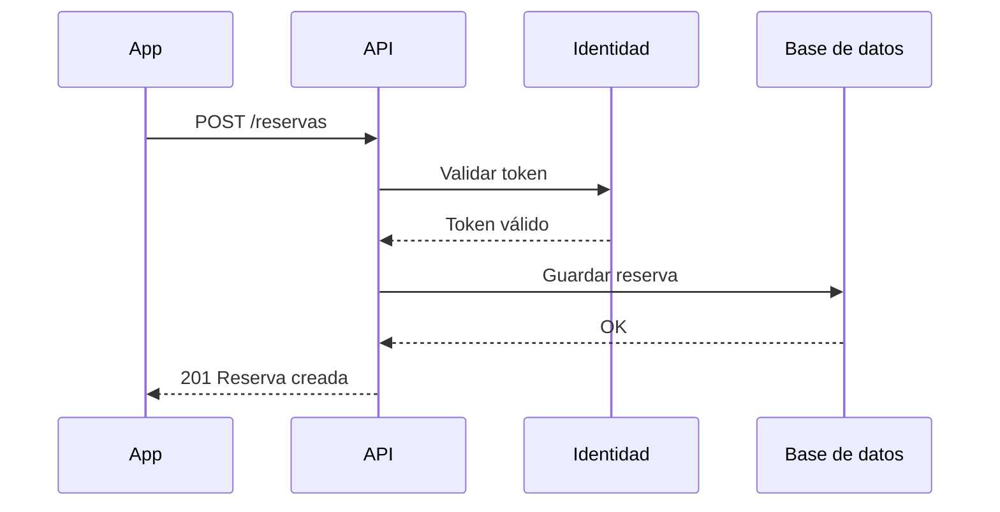

# Arquitectura del backend

El backend expone una API REST y delega la autenticación en un servicio de identidad.

## Crear una reserva



## Petición de ejemplo

```json
{
  "espacio": "sala-3",
  "inicio": "2026-10-02T09:00",
  "duracionMinutos": 120
}
```

## Decisiones

1. **PostgreSQL** como base de datos principal.
2. Colas con *RabbitMQ* para las notificaciones.
3. Despliegue en contenedores, un servicio por dominio.

> Cada decisión se documenta con su contexto y las alternativas descartadas.
