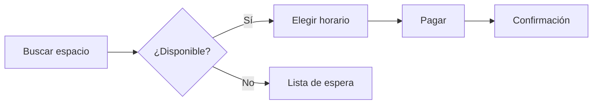

# Plan del proyecto Aurora

Aplicación móvil para reservar espacios de trabajo compartido. Este documento resume los **objetivos**, los *hitos* y el estado del equipo.

## Objetivos del trimestre

- [x] Validar el prototipo con 20 usuarios
- [x] Definir la arquitectura del backend
- [ ] Publicar la beta privada
- [ ] Integrar pagos en línea

## Hitos

| Hito                | Responsable | Fecha  | Estado       |
|---------------------|-------------|--------|--------------|
| Prototipo navegable | Laura       | 15 jul | ✅ Listo     |
| API de reservas     | Andrés      | 12 ago | ✅ Listo     |
| Beta privada        | Camila      | 30 sep | 🚧 En curso  |
| Lanzamiento         | Equipo      | 15 nov | ⏳ Pendiente |

## Flujo de una reserva

> **Nota:** las fechas se revisan cada lunes en la reunión de seguimiento.

## Próximos pasos

1. Cerrar el diseño de la pantalla de pagos.
2. Preparar la encuesta para los usuarios de la beta.
3. Revisar los costos de infraestructura con el equipo de operaciones.
