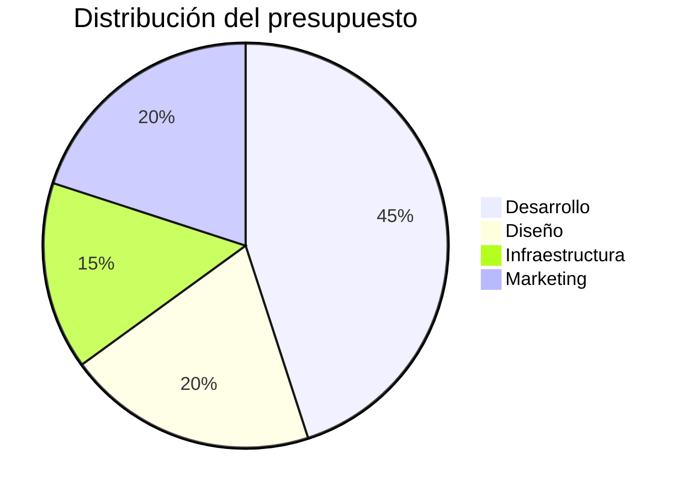

# Presupuesto 2026

Distribución aprobada en la reunión de planeación de enero.

## Detalle por rubro

| Rubro           | Monto (USD) | Porcentaje |
|-----------------|------------:|-----------:|
| Desarrollo      |      45.000 |       45 % |
| Diseño          |      20.000 |       20 % |
| Infraestructura |      15.000 |       15 % |
| Marketing       |      20.000 |       20 % |
| **Total**       | **100.000** |  **100 %** |

## Supuestos

- El equipo de desarrollo se mantiene en **cinco personas**.
- La infraestructura crece al ritmo de los usuarios activos.
- El marketing se concentra en el lanzamiento de noviembre.
